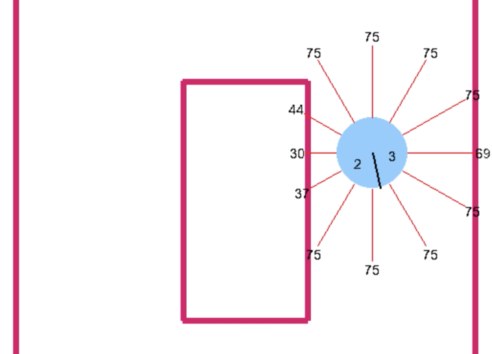

# Mobile robot simulator

A project that simulates a vacuum cleaning robot in different environments.
The robot has two wheels. For each wheel the speed can be regulated individually. In this way the robot can move left and right. The speed of each wheel is displayed on the robot.
The robot is also equiped with 12 distance sensors that measure the distance to the walls around it when close enough.

## The code
Run the main function in `playground.py` to start the simulator.

The robot can be navigated using 
- :arrow_up: to increase forward speed on both wheels
- :arrow_down: to decrease forward speed on both wheels
- :arrow_left: to increase speed of left wheel
- :arrow_right: to increase speed on right wheel
- Key `a` to decrease speed of left wheel
- Key `d` to decrease speed of right wheel

Key `x` stops the robot and `0` stops the simulation.

## Next steps
As next steps, the robot will be trained using an evolutionary algorithm. Apart from that, a localization with Kalman filter will be provided.
